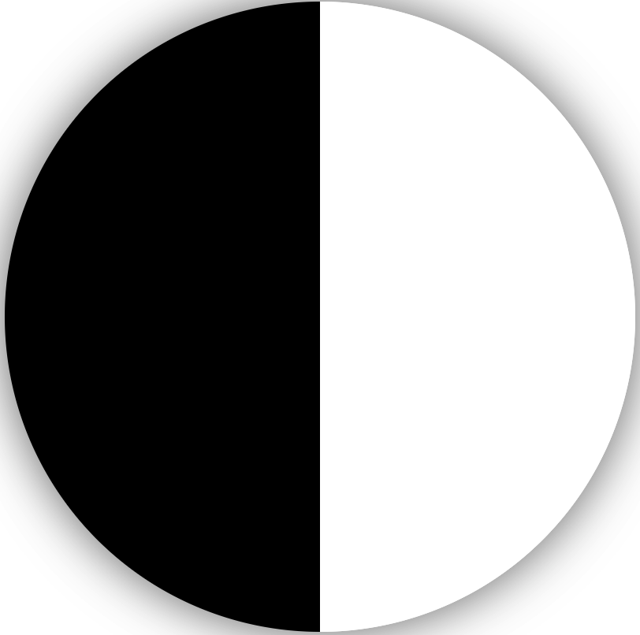

# 一个div实现旋转太极图
#### 第一步，实现左侧半圆黑色，右侧半圆白色，可以利用border来实现

```html
 .tai-ji {
            width: 0;
            height: 400px;
            margin: 50px auto;
            position: relative;
            border-left: 200px solid #000;
            border-right: 200px solid #fff;
            box-shadow: 0 0 30px rgba(0, 0, 0, .5);
            border-radius: 400px;
        }
```





#### 第二步，利用伪元素::before和::after实现太极图里面的两个大圆和两个小圆，首先利用::before实现两个大圆，因为使用一个::before来实现黑白两个大圆，所以实现一个很简单，另外一个该怎么实现呢？

```HTML
 .tai-ji::before,
        .tai-ji::after {
            position: absolute;
            content: "";
            border-radius: 50%;
        }

        .tai-ji::before {
            width: 200px;
            height: 200px;
            background-color: white;
            left: -100px;
        }
```


#### 发现还缺少一个黑色的圆，该怎么实现呢，想到了CSS3的box-shadow,利用box-shadow来实现，只需要调整box-shadow的位置就可以了

```html
.tai-ji::before,
.tai-ji::after {
    position: absolute;
    content: "";
    border-radius: 50%;
}

.tai-ji::before {
    width: 200px;
    height: 200px;
    background-color: white;
    left: -100px;
    box-shadow: 0 200px 0 black;
}
```


#### 第三步，利用同样的原理，使用::after把两个小圆也添加进来

```html
.tai-ji::after {
    width: 60px;
    height: 60px;
    top: 60px;
    left: -30px;
    background-color: #000;
    box-shadow: 0 200px 0 #fff;
}
```


#### 第四步，加上旋转动画，利用animation @keyframes

```html
.tai-ji {
    width: 0;
    height: 400px;
    margin: 50px auto;
    position: relative;
    border-left: 200px solid #000;
    border-right: 200px solid #fff;
    box-shadow: 0 0 30px rgba(0, 0, 0, .5);
    border-radius: 400px;
    animation: myTaiJiAni 5s linear infinite;
    -webkit-animation: myTaiJiAni 5s linear infinite;
    -moz-animation: myTaiJiAni 5s linear infinite;
    -o-animation: myTaiJiAni 5s linear infinite;
}
```

```html
@keyframes myTaiJiAni {
    100% {
        transform: rotate(-360deg)
    }
}

@-webkit-keyframes myTaiJiAni {
    100% {
        transform: rotate(-360deg)
    }
}
```

#### ok,旋转的太极图实现了，总结下：

##### 1.实现左黑又白的圆

##### 2.利用伪元素实现两个大圆和两个小圆

##### 3.加上旋转动画


